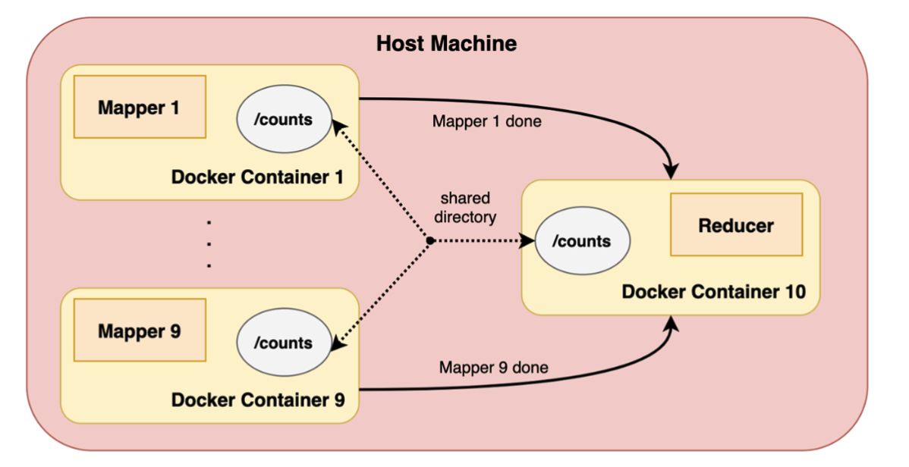

# Naive MapReduce Project
This project counts and ranks word occurences in a text file, using a naive MapReduce approach to motivate and understand Google's MapReduce solution. MapReduce consits of a user specifying a _map_ function that processes data into 
intermediate key/value pairs, which are then _reduced_ by merging all intermediate key/value 
pairs associated with the same intermediate key. 

The dataset for this project consists of webscraped text data of Stack Overflow Question titles, which has been partitioned into 9 different text files. These files are stored in `titles/`. 

The host machine launches Docker containers to tally wordcounts in each text file (_Mapping task_), writing results as JSON files in a filesystem shared with the host machine.

After all word count tasks have finished, the host combines and orders wordcount results results (_Reducing task_),
writing the sorted, merged wordcount key/value pairs result to `counts/total_counts.json`

  

# Setup and run
* Open Docker
* Build the mapping container with `./build_mapper.sh`
* Run word counter with `./count_words.sh`

## MapReduce History
Google developed MapReduce to efficiently crawl, categorize, and index the internet, for use as inputs into the PageRank algorithm. PageRank evaluates the importance of web pages based off of the quality and quantity of inbound links.  AFter scraping raw HTML data with web crawlers, Google used the Map Phase to parse HTML files into key-value pairs. The Reduce Phase sums up contributions for a given URL to determine its rank

## Shortcomings of Naive approach
- **Local compute**: Containers run in parallel using the `&` opperator, but MapReduce is meant to run on a distributed network of commoditized hardware with fault tolerance, rather than on a local machine  
- **I/O Overhead**: Reading entire files into memory in Docker containers creates I/O overhead, particularly for large files
- **Dictionary Overhead**: Using a single dictionary (+=) to accumulate word counts requires loading all intermediate data into memory at once. Python’s dictionary implementation is not optimized for large-scale parallel reductions. Handling collisions and resizing adds overhead compared to specialized data structures
- **Data Shuffling and Sorting**: TODO: writeup
- **Containerization Overhead**: Docker container startup times add latency for each file. Container orchestration tools (e.g., Docker Swarm or Kubernetes) are not inherently optimized for fine-grained MapReduce-style workloads

Click to expand references

  
# References
* Docker Volume mounting - https://docs.docker.com/engine/storage/#volume-mounts
* Google MapReduce paper - https://static.googleusercontent.com/media/research.google.com/en//archive/mapreduce-osdi04.pdf

